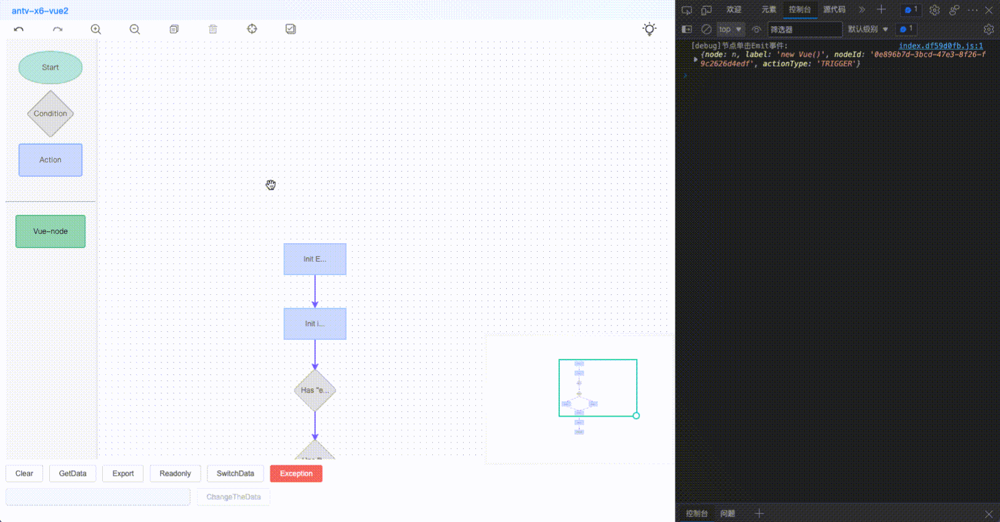

# antv-x6-vue2

@antv/x6 基于 vue2 + composition-api 的图形化编辑器



#### 支持触控屏版: [在线访问](https://g0ngjie.github.io/antv-x6-vue3-demo/)
[在线访问](https://g0ngjie.github.io/alrale-laboratory/materials/x6/#/)

- [x] 画布自适应
- [x] 快捷键
- [x] 工具栏 组合按键功能
- [x] 事件监听
- [x] vue 自定义组件

### 使用

> main.js

```js
import Vue from "vue";
import antv from "antv-x6-vue2";
import "antv-x6-vue2/lib/antv.css";

Vue.use(antv);
```

> vue2 文件中使用

```vue
<template>
  <div>
    <antv-x6-vue2></antv-x6-vue2>
  </div>
</template>
```

#### Api

| 说明                                 | 函数                                                                                   |
| :----------------------------------- | -------------------------------------------------------------------------------------- |
| 初始化画布默认数据                   | initDefaultData(nodes: any[], edges: any[]): void                                      |
| 获取数据                             | exportData(): { nodes: string[], edges: string[], nodesJSON: any[], edgesJSON: any[] } |
| 画布只读                             | onlyLook(bool: boolean): void                                                          |
| 画布清空                             | clean(): void                                                                          |
| 修改 Node 节点文案                   | updateLabel(label: string): void                                                       |
| 监听单元事件双击回调                 | GraphListener.doubleNodeClick(cb: ICallbackFunc): void                                 |
| 监听单元事件单击回调                 | GraphListener.nodeClick(cb: ICallbackFunc): void                                       |
| 运行时异常监听                       | GraphListener.runtimeError(cb: IErrorCallbackFunc): void                               |
| 图形校验函数                         | graphValidate(): { ok: boolean, errs: string[] }                                       |
| 获取所有已存在的 node 节点和 edge 边 | getAtoms(options?: 'nodes' \| 'edges'): { nodes: ...[], edges: ...[] } \| undefined    |

#### Events

> 组件事件

| 事件名        | 说明                          | 参数                                |
| ------------- | ----------------------------- | ----------------------------------- |
| node-click    | Node 节点被点击时会触发该事件 | { nodeId, actionType, label, node } |
| node-dblclick | Node 节点被双击时会触发该事件 | { nodeId, actionType, label, node } |

```js
import { graphFunc } from "antv-x6-vue2";

graphFunc.GraphListener.doubleNodeClick((detail) => {
  const { nodeId, label, actionType } = detail;
});
```

#### 异常类

| 错误码(errorCode) | 说明(errorMsg) |
| ----------------- | -------------- |
| 2000              | 非法参数       |
| 2001              | 验证失败       |
| 2002              | 数据格式不正确 |

```js
import { graphFunc } from "bt-antv-x6";

graphFunc.GraphListener.runtimeError((err) => {
  const { errorCode, errorMsg } = err;
});
```
